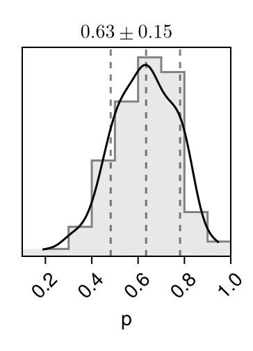
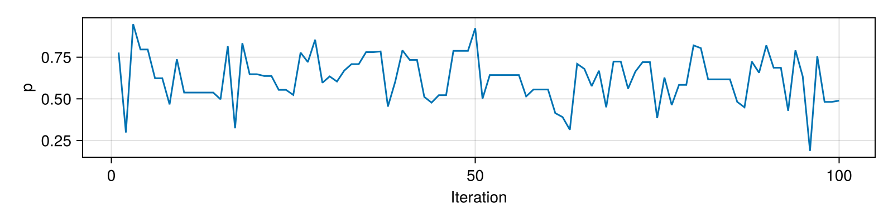
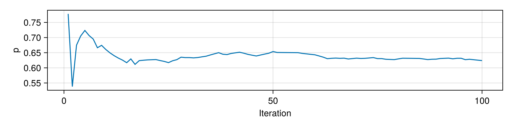

## Pair plot 

Diagonal entries show estimates of the marginal 
densities as well as the (0.16, 0.5, 0.84) 
quantiles (dotted lines). 
Off-diagonal entries show estimates of the pairwise 
densities. 

Movie linked below (🍿) superimposes 
100 iterations 
of MCMC. 

```@raw html

<a href="pair_plot.png"> 🔍 Full page </a> ⏐<a href="moving_pair.mp4">🍿 Movie </a> ⏐<a href="https://sefffal.github.io/PairPlots.jl">🔗 Info </a>
```


## Trace plots 


```@raw html

<a href="trace_plot.png"> 🔍 Full page </a>  
```


## Moments 

| **parameters** | **mean** | **std** | **mcse**  | **ess\_bulk** | **ess\_tail** | **rhat** | **ess\_per\_sec** |
|---------------:|---------:|--------:|----------:|--------------:|--------------:|---------:|------------------:|
| p              | 0.62398  | 0.14187 | 0.0175221 | 68.7951       | 108.128       | 1.03399  | 13.0294           |
 

```@raw html
<a href="Moments.csv">💾 CSV</a> 
```


## Cumulative traces 

For each iteration ``i``, shows the running average up to ``i``,
``\frac{1}{i} \sum_{n = 1}^{i} x_n``. 

```@raw html

<a href="cumulative_trace_plot.png"> 🔍 Full page </a>  
```

