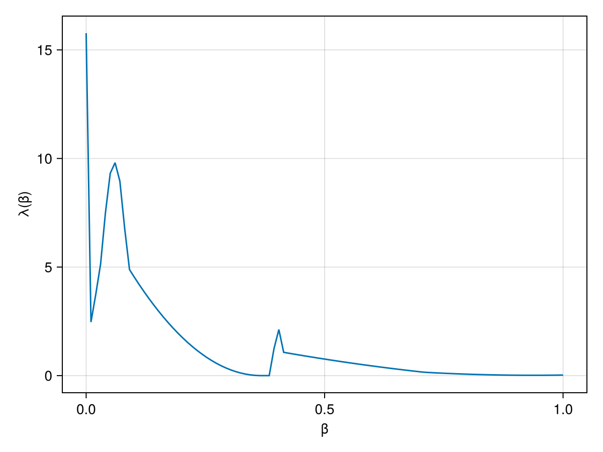
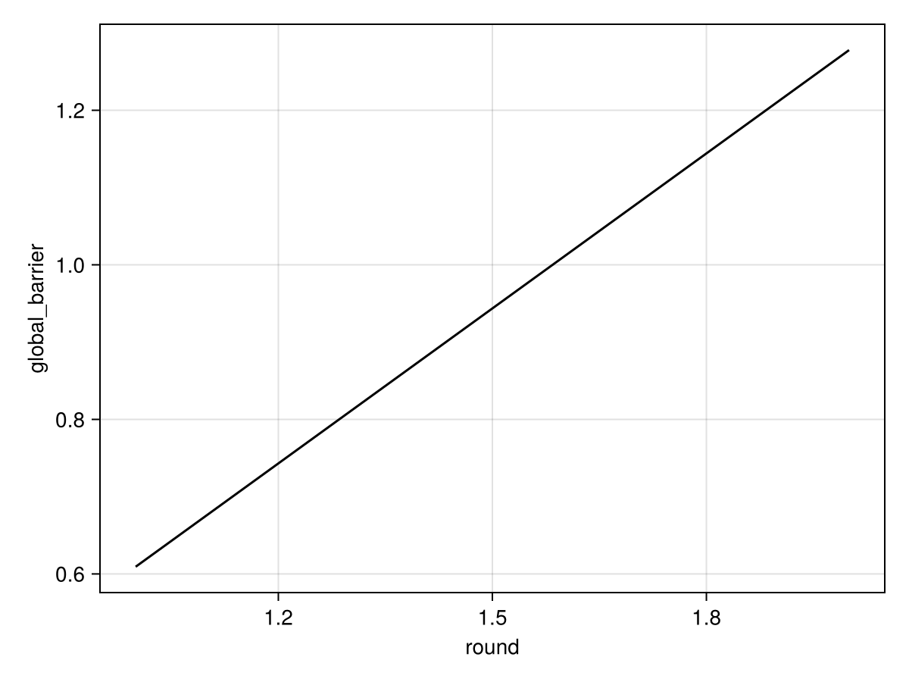
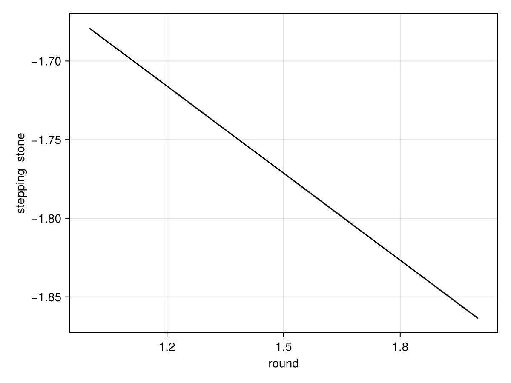
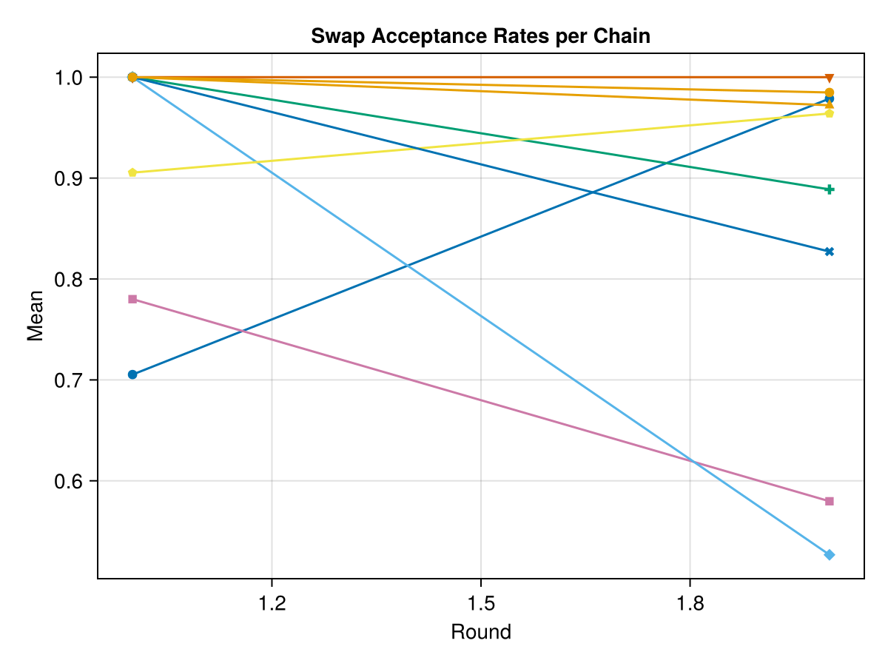

## Description 

The model description can use math: ``x^2``.
Citation: [neal_slice_2003](@citet)


## Local communication barrier 

When the global communication barrier is large, many chains may 
be required to obtain tempered restarts.

The local communication barrier can be used to visualize the cause 
of a high global communication barrier. For example, if there is a 
sharp peak close to a reference constructed from the prior, it may 
be useful to switch to a [variational approximation](https://pigeons.run/dev/variational/#variational-pt).

```@raw html

<a href="local_barrier.png"> 🔍 Full page </a>  ⏐<a href="https://pigeons.run/dev/output-pt/#Local-communication-barrier">🔗 Info </a>
```


## GCB estimation progress 

Estimate of the Global Communication Barrier (GCB) 
as a function of 
the adaptation round. 

The global communication barrier can be used 
to set the number of chains. 
The theoretical framework of [Syed et al., 2021](https://academic.oup.com/jrsssb/article/84/2/321/7056147)
yields that under simplifying assumptions, it is optimal to set the number of chains 
(the argument `n_chains` in `pigeons()`) to roughly 2Λ.

Last round estimate: ``1.2779245967764699``

```@raw html

<a href="global_barrier_progress.png"> 🔍 Full page </a>  ⏐<a href="https://pigeons.run/dev/output-pt/#Global-communication-barrier">🔗 Info </a>
```


## Evidence estimation progress 

Estimate of the log normalization (computed using 
the stepping stone estimator) as a function of 
the adaptation round. 

Last round estimate: ``-1.8635721386724615``

```@raw html

<a href="stepping_stone_progress.png"> 🔍 Full page </a>  ⏐<a href="https://pigeons.run/dev/output-normalization/">🔗 Info </a>
```


## Swaps plot 


```@raw html

<a href="swaps_plot.png"> 🔍 Full page </a>  
```


## Pigeons summary 

| **round** | **n\_scans** | **n\_tempered\_restarts** | **global\_barrier** | **global\_barrier\_variational** | **last\_round\_max\_time** | **last\_round\_max\_allocation** | **stepping\_stone** |
|----------:|-------------:|--------------------------:|--------------------:|---------------------------------:|---------------------------:|---------------------------------:|--------------------:|
| 1         | 2            | missing                   | 0.609292            | missing                          | 1.5049e-5                  | 11424.0                          | -1.67908            |
| 2         | 4            | missing                   | 1.27792             | missing                          | 2.087e-5                   | 18048.0                          | -1.86357            |
 

```@raw html
<a href="Pigeons_summary.csv">💾 CSV</a> ⏐<a href="https://pigeons.run/dev/output-reports/">🔗 Info </a>
```


## Pigeons inputs 

| **Keys**               | **Values**                                                                              |
|-----------------------:|:----------------------------------------------------------------------------------------|
| extended\_traces       | false                                                                                   |
| checked\_round         | 0                                                                                       |
| extractor              | nothing                                                                                 |
| record                 | Function[Pigeons.log\_sum\_ratio, Pigeons.timing\_extrema, Pigeons.allocation\_extrema] |
| multithreaded          | false                                                                                   |
| show\_report           | true                                                                                    |
| n\_chains              | 10                                                                                      |
| variational            | nothing                                                                                 |
| explorer               | nothing                                                                                 |
| n\_chains\_variational | 0                                                                                       |
| target                 | Pigeons.ScaledPrecisionNormalPath(1.0, 10.0, 2)                                         |
| n\_rounds              | 2                                                                                       |
| exec\_folder           | nothing                                                                                 |
| reference              | nothing                                                                                 |
| checkpoint             | false                                                                                   |
| seed                   | 1                                                                                       |
 

```@raw html
<a href="Pigeons_inputs.csv">💾 CSV</a> ⏐<a href="https://pigeons.run/dev/reference/#Pigeons.Inputs">🔗 Info </a>
```

