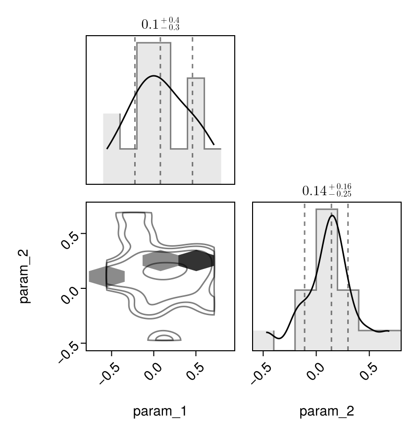
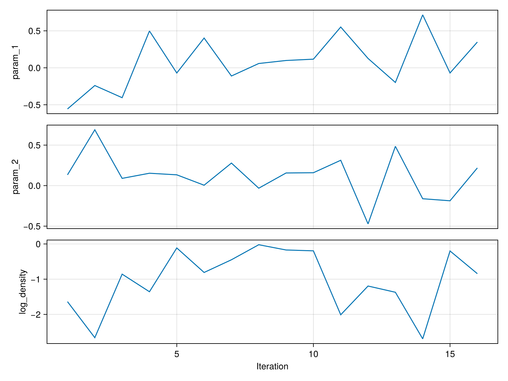
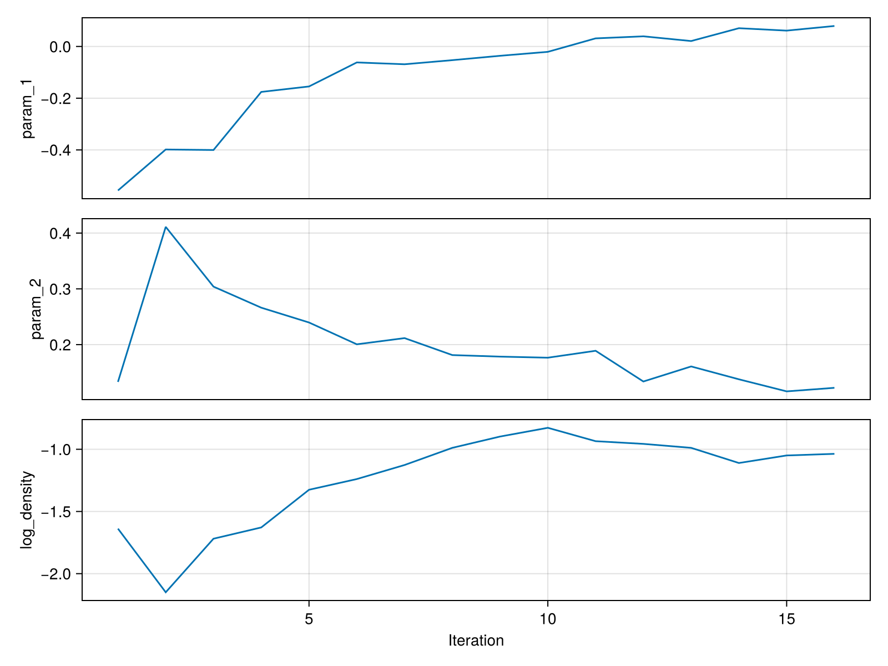
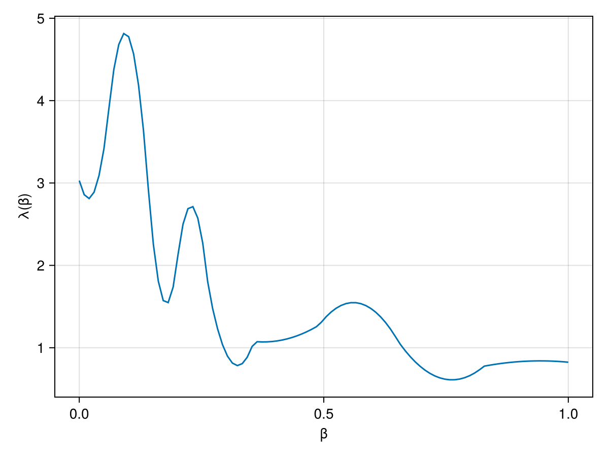
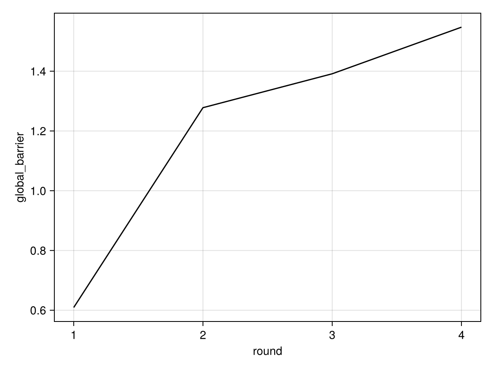
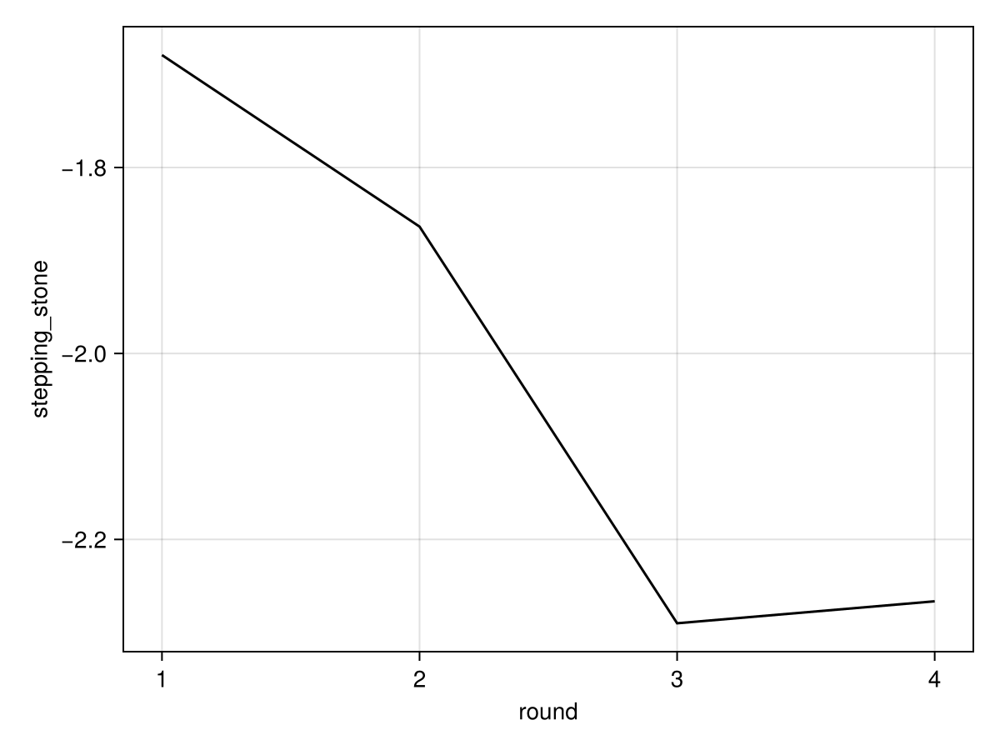
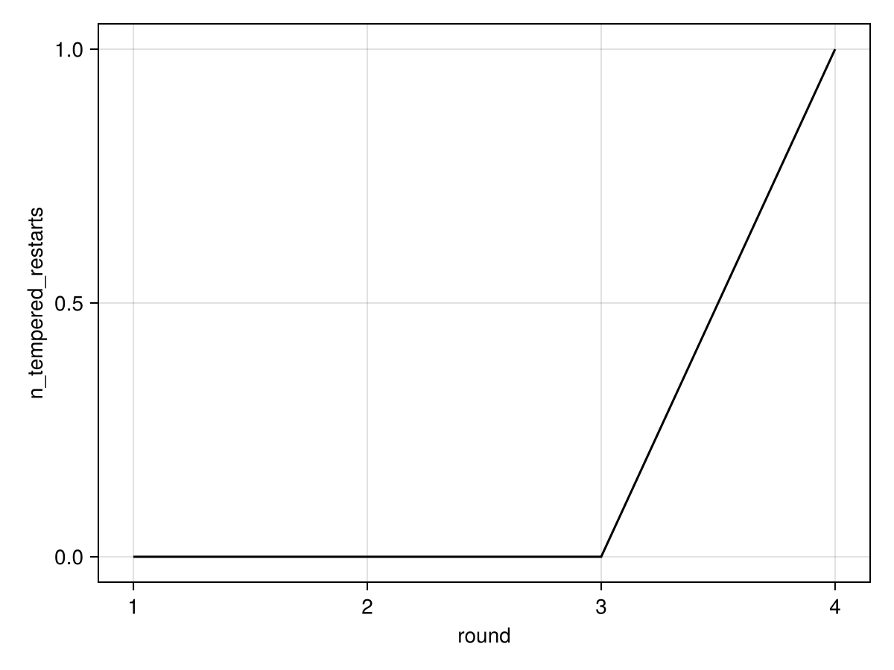
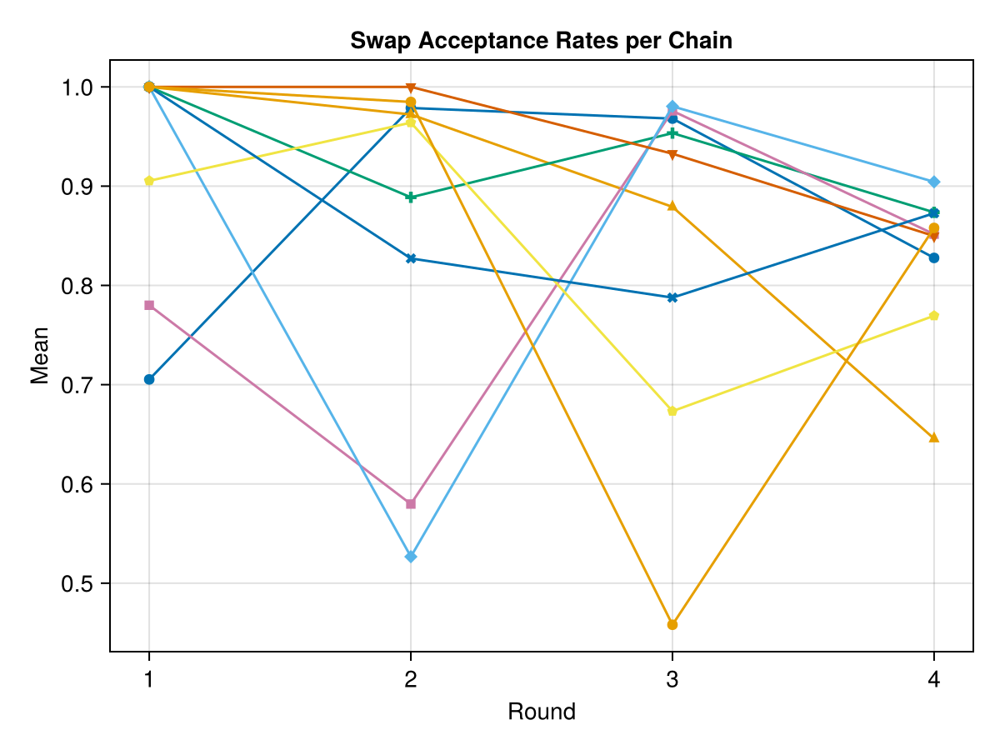

## Pair plot 

Diagonal entries show estimates of the marginal 
densities as well as the (0.16, 0.5, 0.84) 
quantiles (dotted lines). 
Off-diagonal entries show estimates of the pairwise 
densities. 

Movie linked below (🍿) superimposes 
16 iterations 
of MCMC. 




## Trace plots 





## Moments 

| **parameters** | **mean**  | **std**  | **mcse** | **ess\_bulk** | **ess\_tail** | **rhat** | **ess\_per\_sec** |
|---------------:|----------:|---------:|---------:|--------------:|--------------:|---------:|------------------:|
| param\_1       | 0.0791392 | 0.354268 | 0.113288 | 6.85491       | 16.5161       | 1.14788  | missing           |
| param\_2       | 0.122547  | 0.270104 | 0.061537 | 19.2659       | 19.2659       | 1.07457  | missing           |
| log\_density   | -1.03669  | 0.873466 | 0.2003   | 14.9962       | 16.5161       | 0.958739 | missing           |
 

```@raw html
<a href="Moments.csv">💾 CSV</a> 
```


## Cumulative traces 

For each iteration ``i``, shows the running average up to ``i``,
``\frac{1}{i} \sum_{n = 1}^{i} x_n``. 




## Local communication barrier 

When the global communication barrier is large, many chains may 
be required to obtain tempered restarts.

The local communication barrier can be used to visualize the cause 
of a high global communication barrier. For example, if there is a 
sharp peak close to a reference constructed from the prior, it may 
be useful to switch to a [variational approximation](https://pigeons.run/dev/variational/#variational-pt).




## GCB estimation progress 

Estimate of the Global Communication Barrier (GCB) 
as a function of 
the adaptation round. 

The global communication barrier can be used 
to set the number of chains. 
The theoretical framework of [Syed et al., 2021](https://academic.oup.com/jrsssb/article/84/2/321/7056147)
yields that under simplifying assumptions, it is optimal to set the number of chains 
(the argument `n_chains` in `pigeons()`) to roughly 2Λ.

Last round estimate: ``1.5473475289306295``




## Evidence estimation progress 

Estimate of the log normalization (computed using 
the stepping stone estimator) as a function of 
the adaptation round. 

Last round estimate: ``-2.2665306863458055``




## Round trips 

Number of tempered restarts  
as a function of 
the adaptation round. 

A tempered restart happens when a sample from the 
reference percolates to the target. When the reference 
supports iid sampling, tempered restarts can enable 
large jumps in the state space.




## Swaps plot 





## Pigeons summary 

| **round** | **n\_scans** | **n\_tempered\_restarts** | **global\_barrier** | **global\_barrier\_variational** | **last\_round\_max\_time** | **last\_round\_max\_allocation** | **stepping\_stone** |
|----------:|-------------:|--------------------------:|--------------------:|---------------------------------:|---------------------------:|---------------------------------:|--------------------:|
| 1         | 2            | 0                         | 0.609292            | missing                          | 3.4916e-5                  | 10048.0                          | -1.67908            |
| 2         | 4            | 0                         | 1.27792             | missing                          | 4.2451e-5                  | 16064.0                          | -1.86357            |
| 3         | 8            | 0                         | 1.3914              | missing                          | 5.4193e-5                  | 31392.0                          | -2.29016            |
| 4         | 16           | 1                         | 1.54735             | missing                          | 5.752e-5                   | 55616.0                          | -2.26653            |
 

```@raw html
<a href="Pigeons_summary.csv">💾 CSV</a> ⏐<a href="https://pigeons.run/dev/output-reports/">🔗 Info </a>
```


## Pigeons inputs 

| **Keys**               | **Values**                                                                                                                   |
|-----------------------:|:-----------------------------------------------------------------------------------------------------------------------------|
| extended\_traces       | false                                                                                                                        |
| checked\_round         | 0                                                                                                                            |
| extractor              | nothing                                                                                                                      |
| record                 | Function[Pigeons.traces, Pigeons.round\_trip, Pigeons.log\_sum\_ratio, Pigeons.timing\_extrema, Pigeons.allocation\_extrema] |
| multithreaded          | false                                                                                                                        |
| show\_report           | true                                                                                                                         |
| n\_chains              | 10                                                                                                                           |
| variational            | nothing                                                                                                                      |
| explorer               | nothing                                                                                                                      |
| n\_chains\_variational | 0                                                                                                                            |
| target                 | Pigeons.ScaledPrecisionNormalPath(1.0, 10.0, 2)                                                                              |
| n\_rounds              | 4                                                                                                                            |
| exec\_folder           | nothing                                                                                                                      |
| reference              | nothing                                                                                                                      |
| checkpoint             | false                                                                                                                        |
| seed                   | 1                                                                                                                            |
 

```@raw html
<a href="Pigeons_inputs.csv">💾 CSV</a> ⏐<a href="https://pigeons.run/dev/reference/#Pigeons.Inputs">🔗 Info </a>
```

