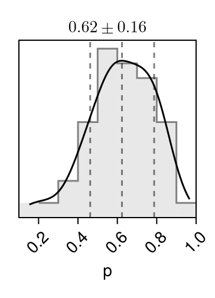
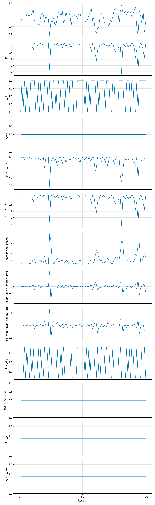
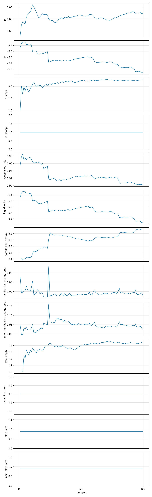

## Pair plot 

Diagonal entries show estimates of the marginal 
densities as well as the (0.16, 0.5, 0.84) 
quantiles (dotted lines). 
Off-diagonal entries show estimates of the pairwise 
densities. 

Movie linked below (🍿) superimposes 
100 iterations 
of MCMC. 

```@raw html

<a href="pair_plot.png"> 🔍 Full page </a> ⏐<a href="moving_pair.mp4">🍿 Movie </a> ⏐<a href="https://sefffal.github.io/PairPlots.jl">🔗 Info </a>
```


## Trace plots 


```@raw html

<a href="trace_plot.png"> 🔍 Full page </a>  
```


## Moments 

| **parameters**                  | **mean**   | **std**  | **mcse**  | **ess\_bulk** | **ess\_tail** | **rhat** | **ess\_per\_sec** |
|--------------------------------:|-----------:|---------:|----------:|--------------:|--------------:|---------:|------------------:|
| p                               | 0.622725   | 0.166302 | 0.0232664 | 49.8066       | 73.5692       | 1.13218  | 11.3766           |
| lp                              | -5.86038   | 0.925155 | 0.164324  | 6.37332       | 62.7936       | 1.13998  | 1.45576           |
| n\_steps                        | 2.28       | 0.964836 | 0.0816807 | 139.53        | NaN           | 0.99167  | 31.8708           |
| is\_accept                      | 1.0        | 0.0      | NaN       | NaN           | NaN           | NaN      | NaN               |
| acceptance\_rate                | 0.904066   | 0.154831 | 0.0172914 | 114.779       | NaN           | 1.03809  | 26.2171           |
| log\_density                    | -5.86038   | 0.925155 | 0.164324  | 6.37332       | 62.7936       | 1.13998  | 1.45576           |
| hamiltonian\_energy             | 6.34116    | 1.34385  | 0.206775  | 6.84805       | 58.9391       | 1.15229  | 1.5642            |
| hamiltonian\_energy\_error      | -0.0125382 | 0.455614 | 0.0322168 | 200.0         | 76.6284       | 1.0506   | 45.683            |
| max\_hamiltonian\_energy\_error | 0.0242602  | 0.534769 | 0.0378139 | 200.0         | 78.3393       | 1.07064  | 45.683            |
| tree\_depth                     | 1.44       | 0.498888 | 0.0455342 | 120.041       | NaN           | 0.996399 | 27.4191           |
| numerical\_error                | 0.0        | 0.0      | NaN       | NaN           | NaN           | NaN      | NaN               |
| step\_size                      | 0.885157   | 0.0      | NaN       | NaN           | NaN           | NaN      | NaN               |
| nom\_step\_size                 | 0.885157   | 0.0      | NaN       | NaN           | NaN           | NaN      | NaN               |
 

```@raw html
<a href="Moments.csv">💾 CSV</a> 
```


## Cumulative traces 

For each iteration ``i``, shows the running average up to ``i``,
``\frac{1}{i} \sum_{n = 1}^{i} x_n``. 

```@raw html

<a href="cumulative_trace_plot.png"> 🔍 Full page </a>  
```

