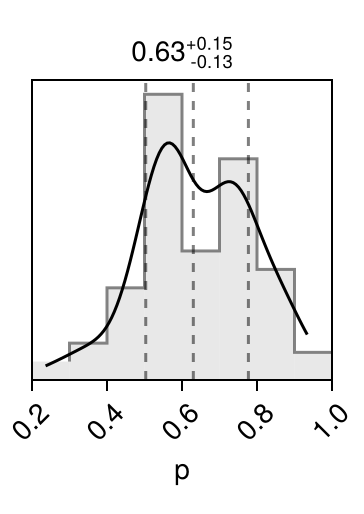
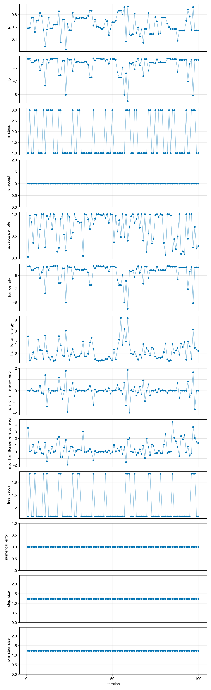
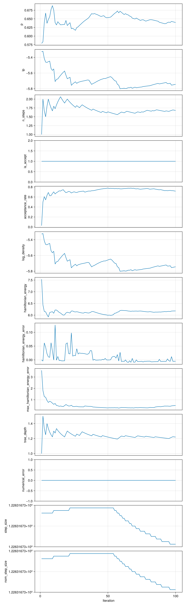

## Pair plot 

Diagonal entries show estimates of the marginal 
densities as well as the (0.16, 0.5, 0.84) 
quantiles (dotted lines). 
Off-diagonal entries show estimates of the pairwise 
densities. 

Movie linked below (🍿) superimposes 
100 iterations 
of MCMC. 

```@raw html

<a href="pair_plot.png"> 🔍 Full page </a> ⏐<a href="moving_pair.mp4">🍿 Movie </a> ⏐<a href="https://sefffal.github.io/PairPlots.jl">🔗 Info </a>
```


## Trace plots 


```@raw html

<a href="trace_plot.png"> 🔍 Full page </a>  
```


## Intervals 

Nominal coverage requested: 0.95 
(change via `interval_probability` option which can be passed to `report()`). 

The **credible** interval `(naive_left, naive_right)` is constructed using the quantiles 
of the posterior distribution. It is naive in the sense that it does not take 
into account additional uncertainty brought by the Monte Carlo approximation. 

The radius of a Monte Carlo **confidence interval** with the same nominal coverage, 
constructed on each of the end points of the naive interval is shown in 
`mcci_radius_left` and `mcci_radius_left`. 

Finally, `(fused_left, fused_right)` is obtained by merging the two sources of 
uncertainty: statistical, captured by the credible interval, and computational, 
captured by the confidence intervals on the end points. 

| **parameters**                  | **naive\_left** | **naive\_right** | **mcci\_radius\_left** | **mcci\_radius\_right** | **fused\_left** | **fused\_right** |
|--------------------------------:|----------------:|-----------------:|-----------------------:|------------------------:|----------------:|-----------------:|
| p                               | 0.345455        | 0.902029         | 0.125578               | 0.0571946               | 0.219877        | 0.959224         |
| lp                              | -8.02198        | -5.29585         | 1.13848                | 0.00913723              | -9.16046        | -5.28672         |
| n\_steps                        | 1.0             | 3.0              | 0.0                    | NaN                     | 1.0             | NaN              |
| is\_accept                      | 1.0             | 1.0              | NaN                    | NaN                     | NaN             | NaN              |
| acceptance\_rate                | 0.075407        | 1.0              | 0.107488               | NaN                     | -0.0320807      | NaN              |
| log\_density                    | -8.02198        | -5.29585         | 1.13848                | 0.00913723              | -9.16046        | -5.28672         |
| hamiltonian\_energy             | 5.31674         | 8.17043          | 0.0306709              | 1.90597                 | 5.28606         | 10.0764          |
| hamiltonian\_energy\_error      | -1.54241        | 1.53378          | 0.622431               | 0.833964                | -2.16484        | 2.36775          |
| max\_hamiltonian\_energy\_error | -1.35442        | 3.3143           | 0.966352               | 1.16954                 | -2.32077        | 4.48384          |
| tree\_depth                     | 1.0             | 2.0              | 0.0                    | NaN                     | 1.0             | NaN              |
| numerical\_error                | 0.0             | 0.0              | NaN                    | NaN                     | NaN             | NaN              |
| step\_size                      | 1.22632         | 1.22632          | NaN                    | NaN                     | NaN             | NaN              |
| nom\_step\_size                 | 1.22632         | 1.22632          | NaN                    | NaN                     | NaN             | NaN              |
 

```@raw html
<a href="Intervals.csv">💾 CSV</a> ⏐<a href="https://xkcd.com/2110/">🔗 Info </a>
```


## Moments, MCSE, ESS, etc 

The ESS/MCSE/Rhat estimators use `InferenceReports.safe_summarystats(chains)`, which are based on 
the truncated autocorrelation estimator (Geyer, 1992, sec 3.3) computed with FFT 
with *no lag limit*.  
As a result, these estimators should be 
safe to use in the low relative ESS regime, in contrast to the defaults used in MCMCChains, 
[which lead to catastrophic ESS over-estimation in that regime](https://ubc-stat-ml.github.io/ess-bench/report.html).

| **parameters**                  | **mean**    | **std**     | **mcse**    | **ess\_bulk** | **ess\_tail** | **rhat** | **ess\_per\_sec** |
|--------------------------------:|------------:|------------:|------------:|--------------:|--------------:|---------:|------------------:|
| p                               | 0.63953     | 0.14623     | 0.0201761   | 55.5342       | NaN           | 1.04068  | 10.8784           |
| lp                              | -5.74421    | 0.661847    | 0.0943627   | 36.4256       | NaN           | 1.04186  | 7.13529           |
| n\_steps                        | 1.68        | 0.95219     | 0.107592    | 78.3228       | NaN           | 0.991716 | 15.3424           |
| is\_accept                      | 1.0         | 0.0         | NaN         | NaN           | NaN           | NaN      | NaN               |
| acceptance\_rate                | 0.716927    | 0.322434    | 0.037533    | 108.609       | NaN           | 1.04665  | 21.275            |
| log\_density                    | -5.74421    | 0.661847    | 0.0943627   | 36.4256       | NaN           | 1.04186  | 7.13529           |
| hamiltonian\_energy             | 6.17928     | 0.823262    | 0.143866    | 23.3305       | 56.5092       | 1.06053  | 4.57012           |
| hamiltonian\_energy\_error      | -0.00511843 | 0.606101    | 0.0428578   | 200.0         | 99.2247       | 0.991837 | 39.1773           |
| max\_hamiltonian\_energy\_error | 0.498166    | 1.11333     | 0.120163    | 107.54        | 114.53        | 1.07635  | 21.0656           |
| tree\_depth                     | 1.22        | 0.416333    | 0.0456004   | 83.3577       | NaN           | 0.989949 | 16.3286           |
| numerical\_error                | 0.0         | 0.0         | NaN         | NaN           | NaN           | NaN      | NaN               |
| step\_size                      | 1.22632     | 2.23163e-16 | 1.54326e-16 | NaN           | NaN           | NaN      | NaN               |
| nom\_step\_size                 | 1.22632     | 2.23163e-16 | 1.54326e-16 | NaN           | NaN           | NaN      | NaN               |
 

```@raw html
<a href="Moments__MCSE__ESS__etc.csv">💾 CSV</a> 
```


## Cumulative traces 

For each iteration ``i``, shows the running average up to ``i``,
``\frac{1}{i} \sum_{n = 1}^{i} x_n``. 

```@raw html

<a href="cumulative_trace_plot.png"> 🔍 Full page </a>  
```

